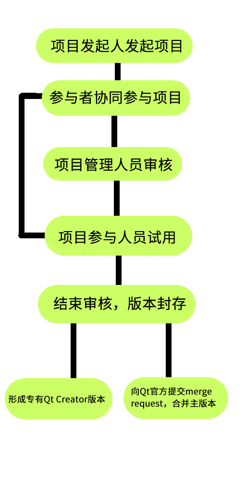
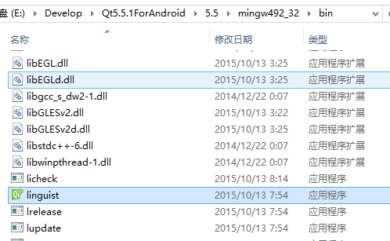
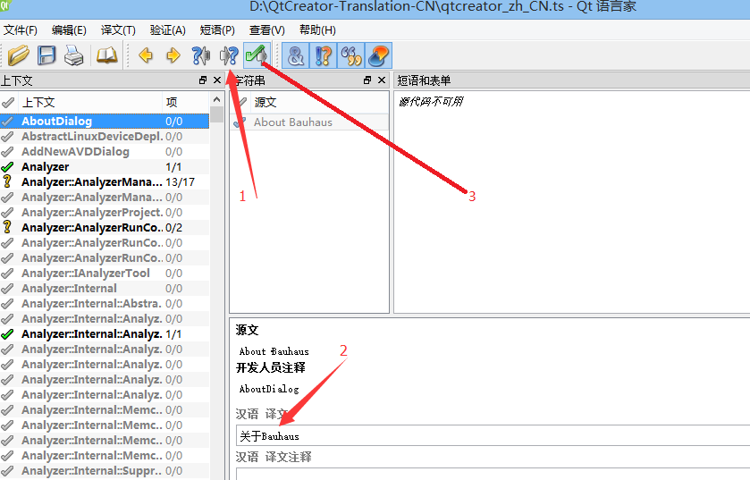

# QtCreator-Translation-CN
This repository is trying to fulfill the lacking Chinese translation for Qt Creator.

欢迎论坛的朋友们踊跃参与Qt Creator的翻译工作。大家都知道，Qt Creator版本更迭非常快，而在此期间，我们发现，Qt Creator的中文翻译越来越少。这是因为在版本经常更新后，翻译没有跟上来的缘故。我们希望，能够利用我们自己的努力，把Qt Creator的中文翻译补全，造福广大中文Qt开发者。于是我在github上发起了Qt Creator的翻译计划。目前计划将Qt Creator的中文翻译共一个文件翻译完毕。粗略地看了一下，有上千个条目，因此，我们需要缜密地组织好才行。
我们已经组织了相关人员来完成这件事，并且制定了工作流程。


Qt的确是一个好的开发平台，我们希望在我们的努力下能够把Qt做得更好更强大！
加入方式：首先fork到自己的repository，然后在本地进行修改，pull了之后再在github上提交Pull request即可。

翻译方法：在得到了ts文件之后找到Qt的Linguist（Qt语言家），比如说我的系统就是这样：



然后简简单单三步就能够顺利地翻译了！



那么如何发起pull request呢？其实也很简单。
1、项目右上角有fork，这样我这个项目就变成你们的项目了。

2、然后在你们fork的项目中发起git clone。使用https或者git协议都可。

3、本地用Qt语言家修改ts文件。

4、在本地commit一次，带上你的信息，究竟修改了哪些部分。

5、开始提交到你的项目中，命令：
```
git push
```

6、在github页面上发起pull request操作，等待我的审核就好了。